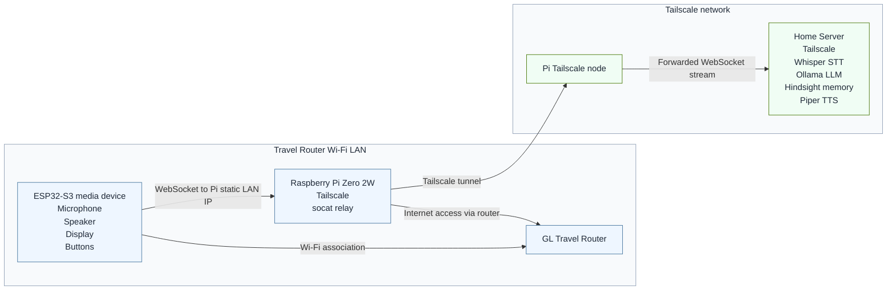
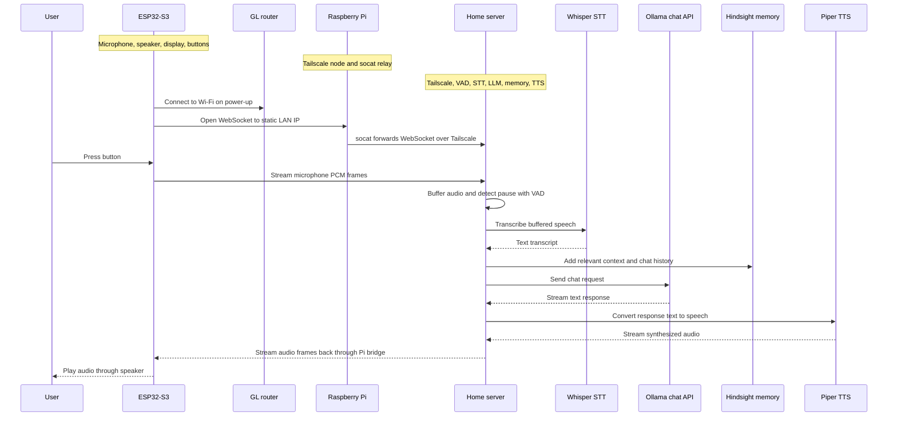

# Tailscale Bridge

This deployment lets an ESP32-S3 media device reach the home voice AI server even though the ESP32 itself does not run Tailscale. The ESP32 connects over Wi-Fi to a GL travel router, opens a WebSocket to a Raspberry Pi Zero 2W at a static LAN IP, and the Pi forwards that WebSocket stream across Tailscale to the home server with `socat`.

## Network Diagram

## Audio Turn Flow

## Bridge Summary

- The ESP32 only needs Wi-Fi access to the GL travel router and the Raspberry Pi's static LAN IP.
- The Raspberry Pi is the bridge between the local Wi-Fi LAN and the Tailscale network.
- `socat` listens for the ESP32 WebSocket connection and forwards traffic to the home server's Tailscale address and WebSocket port.
- The home server runs the full voice pipeline: VAD, Whisper STT, prompt routing, Hindsight memory, Ollama LLM, Piper TTS, and outbound audio streaming.
